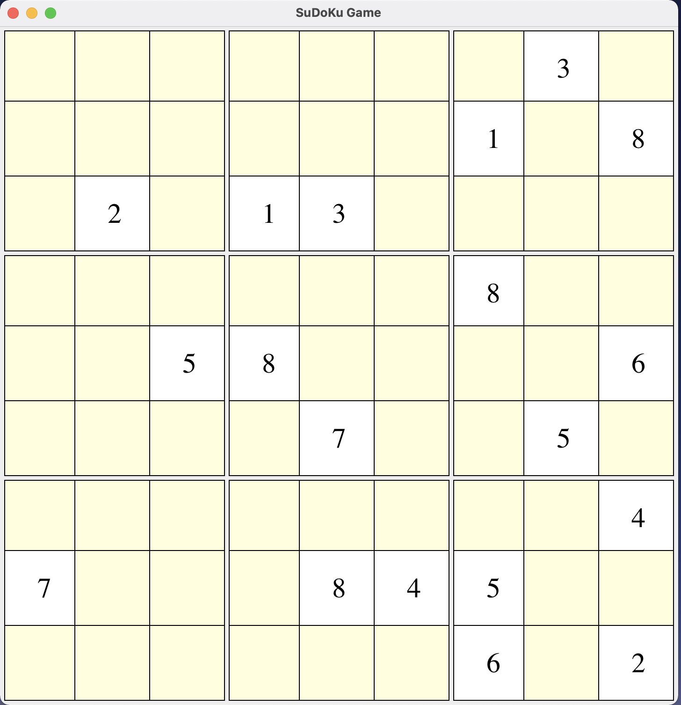
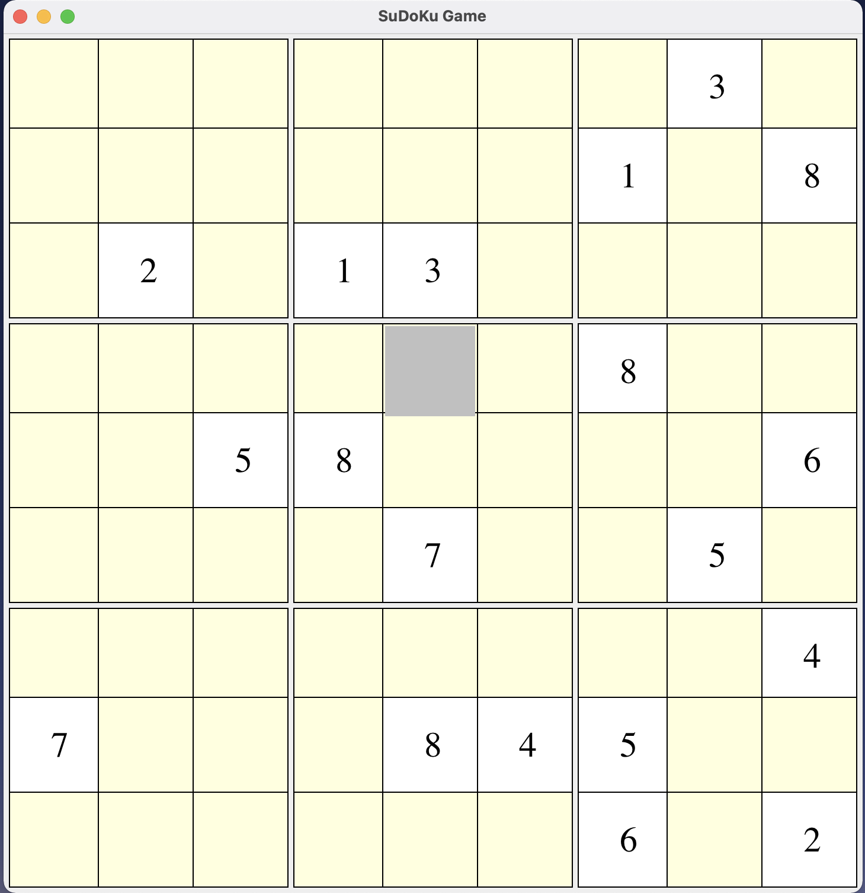
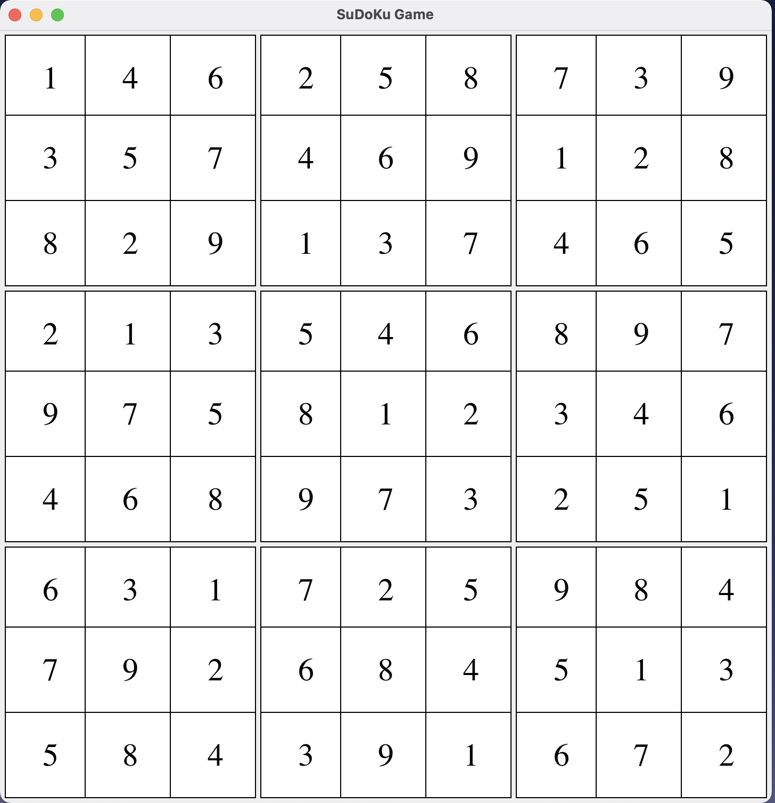

# JavaSudokuGame
this is my first sudoku game app using java, in this project i got an opportunity to learn about Backtracking Algorithm and using it to solve the sudoku game. I also add some method for the user like create a ramdom sudoku game for user to try 

## Guide to play 

1. Start the game 
- find Main.java
- run Main.java 

     
2. Play the game 

2.1 Selecting a Cell 
- click your mouse to a Cell ( sometime the application might not work probably if you double click to a Cell ) 

2.2 Input number into the Cell
- use your keybroad to input a number from 1 to 9 ( Default Mode is 9x9 ) 

2.3 Check if your input number is correct 
- choose the Cell you want to check if it match with the solution ( The Cell's value should be different from 0 )
- press enter to check ( If that Cell's background turn red then it is wrong and green if it is correct )

2.4 Show the solution for the game 
- click on any Cell ( Cell's background should be in light yellow )
- Press space 

3. End the game 
- click on the red node at the top left conner of the application 

## Modification of the game 

1. Change difficult level of the game 
- Find Grid.java
- You can modify the string at the new Game("...",sudoku) 
( there are currently 3 level of the game :
    - easy : there are 71% of the cells are already correct 
    - medium : there are 50% of the cells are already correct 
    - hard : there are 21% of the cells are already correct 
)

2. Change the size of the sudoku
- Find Grid.java 
- You can change the size of the sudoku by add in the size you want in new Game("...",size (int),sudoku)

